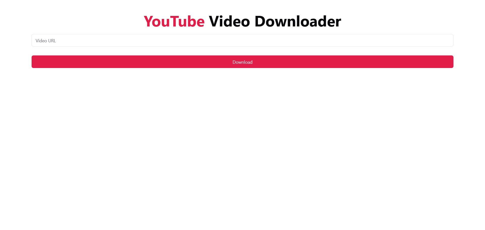

# 🚀 YouTube Video Downloader


YouTube Video Downloader enables quick and easy downloading of YouTube videos. 🚀



## 🔗 Links

- [Live Demo](https://julian-yt-downloader.vercel.app)

## 📐 Tech Stack

### 🎨 Frontend

- Vite
- SvelteKit
- TypeScript
- Tailwind CSS
- shadcn-svelte
- SuperForms
- Formsnap
- Zod
- Axios

### 🛠️ Backend

- Python
- FastAPI
- PyTube

## ✨ Quick Start

Here’s how to set up the project on your local machine.

**Prerequisites**

Ensure that the following are installed on your machine:

- [Git](https://git-scm.com)
- [Docker](https://docker.com)

**Cloning the Repository**

```bash
git clone https://github.com/piaseckijulian/YouTube-Video-Downloader.git
cd YouTube-Video-Downloader
```

**Set Up Environment Variables**

In `api` directory duplicate the `.env.example` file and rename it to `.env`

`YOUTUBE_USERNAME` is the username of a YouTube account

`YOUTUBE_PASSWORD` is the password of a YouTube account

**Running the Project**

```bash
docker compose up --build --watch
```

That's it! - You're good to go. The frontend should be live on http://localhost:5173 and the backend on http://localhost:8000

## 🔥 API Endpoints

- /download-video?url=`VIDEO_URL`

## 🌐 License

This software is licensed under the [MIT License](https://github.com/piaseckijulian/YouTube-Video-Downloader/blob/main/LICENSE)
